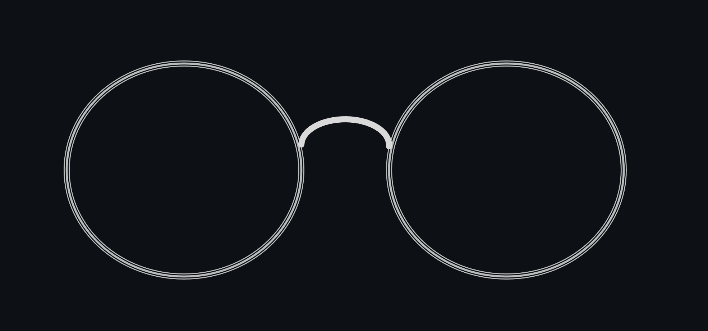
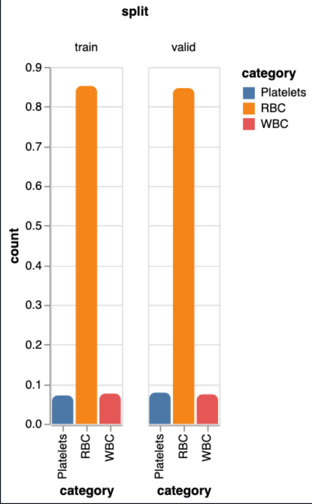
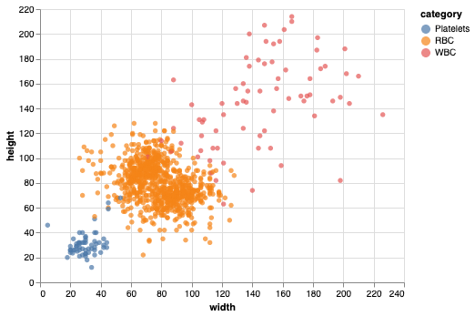
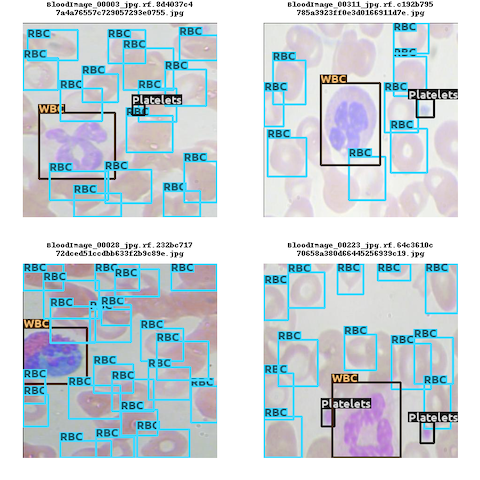

<div align="center">

# Optical

[](https://codecov.io/gh/hashtagml/optical)

[](https://optical.readthedocs.io/en/latest/?badge=latest)


[](https://badge.fury.io/py/optical)
<!-- [](#contributors-) -->

<p align="center"></p>

A collection of utilities for ML vision related tasks.

</div>

## What is optical?

Object detection is one of the mainstream computer vision tasks. However, when it comes to training an object detection model, there is a variety of formats that one has to deal with for different models e.g. `COCO`, `PASCAL VOC`, `Yolo` and so on. `optical` provides a simple interface to convert back and forth between these annotation formats and also perform a bunch of exploratory data analysis (EDA) on these datasets regardless of their source format.

:star2: At present we support the following formats:
- [COCO](https://cocodataset.org/#format-data)
- [PASCAL VOC](http://host.robots.ox.ac.uk/pascal/VOC/voc2012/index.html#data)
- [Yolo](https://github.com/AlexeyAB/darknet)
- [TFrecord](https://www.tensorflow.org/tutorials/load_data/tfrecord)
- [SageMaker Manifest](https://docs.aws.amazon.com/sagemaker/latest/dg/augmented-manifest.html)
- CSV


## Installation

`optical` could be installed from `pip`:

```sh
pip install optical
```

For conversion to (or from) `TFrecord`, please install the `tensorflow` extra:
```sh
pip install `optical[tensorflow]`
```

for visualisation of images in [mediapy](https://github.com/google/mediapy) format, you need to have [ffmpeg](https://ffmpeg.org/download.html) installed in your system.


## Getting Started

### declare the imports
```python
from optical import Annotation
```

### read the annotations
```python
annotation = Annotation(root = "/path/to/dataset", format="coco")
```

optical expects the data to be organised in either of the following layouts:

```sh
root
├── images
│ ├── train
│ ├── val
│ └── test
└── annotations
  ├── train.json
  ├── val.json
  └── test.json
```

Note that for annotation formats which require individual annotations for each images (e.g., `PASCAL VOC` or `Yolo`), 
the `annotations` directory should also contain the same sub-directories as in `images`. The splits that do not have an annotation will be ignored.

If your data does not have a split to begin with, that's acceptable too. In that case the directory layout should be like below:

```sh
root
├── images
│ ├── 1.jpg
│ ├── 2.jpg
│ ├── ...
│ │
│ └── 100.jpg
│
└── annotations
  └── label.json
```

Tha name of the annotation file is not important in this case. But, if your format requires individual formats, the annotation files must have the identical name with that of the image.

### EDA
#### Check data distribution

```python
>>> annotation.describe()

| split | images | annotations | categories |
| ----- | ------ | ----------- | ---------- |
| train | 729    | 1121        | 3          |
| valid | 250    | 322         | 3          |

```
#### Plot label distribution

```python
>>> annotation.show_distribition()
```
<p align="left"></p>


#### Scatter bounding box width and height

```python
>>> annotation.bbox_scatter()
```
<p align="left"></p>

### Visualize images
```python
>>> vis = annotation.visualizer(img_size=256)
>>> vis.show_batch()
```

<p align="left"></p>

### Split the data if required
```python
>>> splits = annotation.train_test_split(test_size = 0.2, stratified = True)
>>> splits.save("/path/to/output/dir")
```

#### Export to other formats
```python
>>> annotation.export(to = "yolo")
```

## Contributing

### Work in local environment:

1. Fork the repo
2. install poetry:
    ```sh
    curl -sSL https://raw.githubusercontent.com/python-poetry/poetry/master/get-poetry.py | python -
    ```

3. work on virtual environment:
   ```sh
   conda create -n optical python=3.8 pip
   ```

4. install the dependencies and the project in editable mode
   ```sh
   poetry install
   ```
5. Make your changes as required. Please use appropriate use of docstrings (we follow [Google style docstring](https://google.github.io/styleguide/pyguide.html)) and try to keep your code clean.

6. Raise a pull request.

### Work inside the dev container:
If you are a Visual Studio Code user, you may choose to develop inside a container. The benefit is the container comes with all necessary settings and dependencies configured. You will need [Docker](https://www.docker.com/) installed in your system. You also need to have the [Remote - Containers](https://marketplace.visualstudio.com/items?itemName=ms-vscode-remote.remote-containers) extension enabled.

1. Open the project in Visual Studio Code. in the status bar, select open in remote container.

It will perhaps take a few minutes the first time you build the container.
