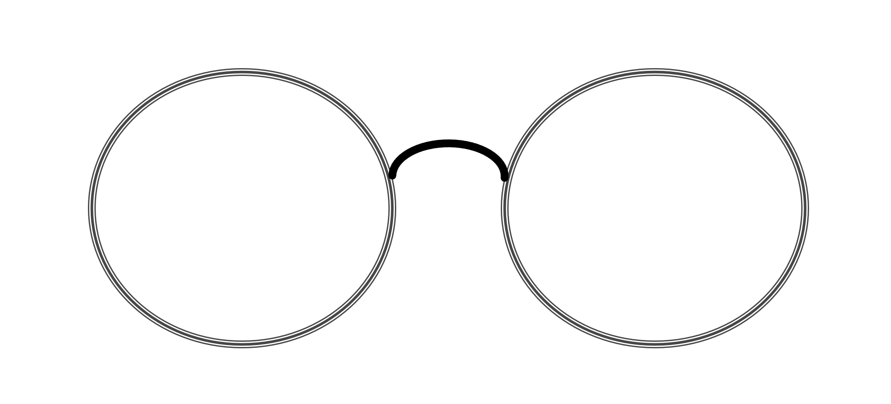

.. optical documentation master file, created by
   sphinx-quickstart on Thu Jan 14 19:22:30 2021.
   You can adapt this file completely to your liking, but it should at least
   contain the root `toctree` directive.

optical
=======

optical is a tool designed to make a bunch of routine computer vision task easy.

.. toctree::
   :caption: Overview
   :titlesonly:
   :maxdepth: 2

   Installation <install>
   Gettign Started <overview>

   
.. toctree::
   :caption: Contributing
   :maxdepth: 4

   Coding Requirements <coding_requirements>
   Issues <issues>
   Tests <tests>
   Setting up a Development Environment <setupdev>
   Documentation <builddocs>
   Pull Requests <pull_requests>

.. toctree::
   :caption: Advanced
   :maxdepth: 1

   API Documentation <api>
   Changelog <changelog>
